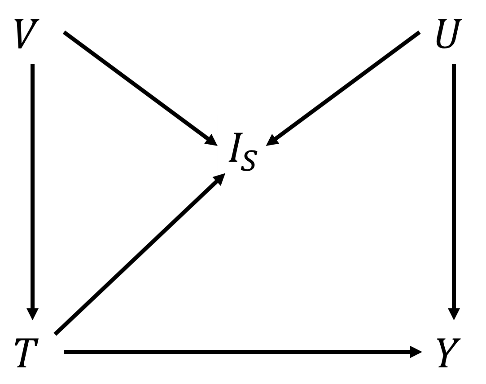

```{r, include = FALSE}
knitr::opts_chunk$set(
  collapse = TRUE,
  comment = "#>"
)
```

```{r setup}
library(SelectionBias)
```

# Introduction

Selecting a study population from a larger source population, based on the research question, is a common procedure, for example in an observational study with data from a population register. Subjects who fulfill all the selection criteria are included in the study population, and subjects who do not fulfill at least one selection criterion are excluded from the study population. These selections might introduce a systematic error when estimating a causal effect, commonly referred to as selection bias. Selection bias can also arise if the selections are involuntary, for example, if there are dropouts or other missing values for some individuals in the study. In an applied study, it is often of interest to assess the magnitude of potential biases using a sensitivity analysis, such as bounding the bias. Two bounds, the SV (Smith and VanderWeele) and AF (assumption-free), for selection bias can be calculated in the R package `SelectionBias`. The content in `SelectionBias` is:

* `zika_learner`: a simulated dataset of zika virus and microcephaly inspired both by data and a previous example [@de2018association;@smith2019bounding]. 
* `SVboundparametersM()`: a function that calculates the sensitivity parameters for the SV bound for an assumed model following the M-structure in Figure 1. 
* `SVbound()`: a function that calculates the SV bound for the relative risk or risk difference in either the total or subpopulation for sensitivity parameters given by the user, or calculated from `SVboundparametersM()`.
* `AFbound()`: a function that calculates the AF bound, for the relative risk or risk difference in either the total or subpopulation, for a dataset that includes observations on an outcome and treatment variable, and either a selection variable or a selection probability.
* `SVboundsharp()`: a function that evaluates if the SV bound for the subpopulation is sharp, inconclusive or not sharp.

For the formulas of the bounds as well as the theory behind them, we refer to the original papers [@smith2019bounding;@zetterstrom2022selection;@zetterstrom2023Rpackage].

{width=30%}


# R package

## Simulated zika dataset

To illustrate the bounds, a simulated dataset, `zika_learner`, is constructed. It is inspired by a numerical zika example used in @smith2019bounding together with a case-control study that investigates the effect of zika virus on microcephaly [@de2018association]. The variables included are: 

* *Living area* $(V)$
* *Socioeconomic status, SES* $(U)$
* *Zika* $(T)$
* *Microcephaly* $(Y)$
* *Birth* $(S_1)$
* *Public hospital* $(S_2)$

The relationships between the variables are illustrated in Figure 2 and Table 1. The prevalences of the variables, and strengths of dependencies between them, are chosen to mimic real data and the assumed values for the sensitivity parameters in @smith2019bounding. The simulated data mimics a cohort with 5000 observations, even though the original study is a case-control study. For more details of the variables and the models, see @zetterstrom2023Rpackage.

{width=50%}

The causal dependencies are generated by the logistic models described in Table 3. 

Table: Table 1. Data generating process for the dataset `zika_learner`. Models generating causal dependencies are logistic, $g(X'\theta)$, for predictor variable $X$ and model parameter $\theta$.

| Model                                 | Coefficients ($\theta$)/Proportions | Function argument    |
| :-----------------------------------: | :---------------------------------: | -------------------: |
| $P(V=1)$                              | $0.85$                              | `Vval`               |
| $P(U=1)$                              | $0.50$                              | `Uval`               |
| $P(T=1|V)=g(V'\theta_T)$              | $(-6.20,1.75)$                      | `Tcoef`              |
| $P(Y=1|T,U)=g[(T,U)'\theta_{Y}]$      | $(-5.20,5.00,-1.00)$                | `Ycoef`              |
| $P(S_1=1|T,U)=g[(V,U,T)'\theta_{S1}]$ | $(1.20,0.00,2.00,-4.00)$            | `Scoef`              |
| $P(S_2=1|T,U)=g[(V,U,T)'\theta_{S1}]$ | $(2.20,0.50,-2.75,0.00)$            | `Scoef`              |

The data was generated in `R`, version 4.2.0, using the package `arm`, version 1.13-1, with the following code:

```{r eval = FALSE}
# Seed.
set.seed(158118)

# Number of observations.
nObs = 5000

# The unmeasured variable, living area (V).
urban = rbinom(nObs, 1, 0.85)

# The treatment variable, zika.
zika_prob = arm::invlogit(-6.2 + 1.75 * urban)
zika = rbinom(nObs, 1, zika_prob)

# The unmeasured variable, SES (U).
SES = rbinom(nObs, 1, 0.5)

# The outcome variable, microcephaly.
mic_ceph_prob = arm::invlogit(-5.2 + 5 * zika - 1 * SES)
mic_ceph = rbinom(nObs, 1, mic_ceph_prob)

# The first selection variable, birth.
birth_prob = arm::invlogit(1.2 - 4 * zika + 2 * SES)
birth = rbinom(nObs, 1, birth_prob)

# The second selection variable, hospital.
hospital_prob = arm::invlogit(2.2 + 0.5 * urban - 2.75 * SES)
hospital = rbinom(nObs, 1, hospital_prob)

# The selection indicator.
sel_ind = birth * hospital
```
The resulting proportions of the `zika_learner` data, for the total dataset, the subset with $S_1=1$ and the subset with $S_1=S_2=1$ are seen in Tables 2-4.

```{r echo = FALSE}
zika_learner2 = zika_learner

zika_learner2$zika = ifelse(zika_learner2$zika==1, "Zika infected", "Not zika infected")

table1::label(zika_learner2$mic_ceph) = "Microcephaly"
table1::label(zika_learner2$urban) = "Living area"
table1::label(zika_learner2$SES) = "SES"

my.render.cont <- function(x) {
  with(table1::stats.apply.rounding(table1::stats.default(x), digits=3, rounding.fn = table1::round_pad), c("",
                                                           "Mean "=sprintf("%s", MEAN)))
}

table1::table1(~ mic_ceph + urban + SES | zika, data=zika_learner2, render.continuous = my.render.cont,
           caption = "Table 2. Proportions for the simulated dataset, by treatment status and overall.")

zika_learner2 = subset(zika_learner2,zika_learner2$birth!=0)

table1::label(zika_learner2$mic_ceph) = "Microcephaly"
table1::label(zika_learner2$urban) = "Living area"
table1::label(zika_learner2$SES) = "SES"

table1::table1(~ mic_ceph + urban + SES | zika, data=zika_learner2, render.continuous = my.render.cont,
       caption = "Table 3. Proportions for the simulated dataset, by treatment status and overall, after the first selection.")

zika_learner2 = subset(zika_learner2,zika_learner2$sel_ind!=0)

table1::label(zika_learner2$mic_ceph) = "Microcephaly"
table1::label(zika_learner2$urban) = "Living area"
table1::label(zika_learner2$SES) = "SES"

table1::table1(~ mic_ceph + urban + SES | zika, data=zika_learner2, render.continuous = my.render.cont,
       caption = "Table 4. Proportions for the simulated dataset, by treatment status and overall, after both selections.")
```
The dataset and data generating process (DGP) can be used to test the functions in `SelectionBias`.


## `SVboundparametersM()`

The sensitivity parameters for the SV bound are calculated for the M-structure, illustrated in Figure 1. The sensitivity parameters are only calculated for an assumed model structure, since they depend on the unobserved variable, *U*. However, the observed probabilities of the outcome, $P(Y=1|T=t,I_S=1)$, $t=0,1$ are inputs since they are used to check if the causal estimand for the assumed DGP is greater or smaller than the observed estimand. The code and the output are:
```{r eval = TRUE}
SVboundparametersM(whichEst = "RR_sub",
                   Vval = matrix(c(1, 0, 0.85, 0.15), ncol = 2),
                   Uval = matrix(c(1, 0, 0.5, 0.5), ncol = 2),
                   Tcoef = c(-6.2, 1.75),
                   Ycoef = c(-5.2, 5.0, -1.0),
                   Scoef = matrix(c(1.2, 2.2, 0.0, 0.5,
                                    2.0, -2.75, -4.0, 0.0),
                                  ncol = 4),
                   Mmodel = "L",
                   pY1_T1_S1 = 0.286,
                   pY1_T0_S1 = 0.004)
```
The first argument is `whichEst`, where the user inputs the causal estimand of interest. It must be one of the four `RR_tot`, `RD_tot`, `RR_sub` or `RD_sub`. Second, the argument `Vval` takes the matrix for *V* as input. The first column contains the values that *V* can take, and the second column contains the corresponding probabilities. In this example, *V* is binary, so the first two elements in the matrix are 1 and 0. However, any discrete *V* can be used. An approximation of a continuous *V* can be used, if it is discretized. The third argument is `Uval`, which takes the matrix for *U* as input. The matrix *U* has a similar structure as *V*. The fourth argument is `Tcoef`, containing the coefficients used in the model for *T*. The first entry in `Tcoef` is the intercept of the model, and the second the slope for *V*. The fifth argument is `Ycoef`, containing the coefficient vector for the outcome model, where the first entry is the intercept, the second the slope coefficient for *T* and third is the slope coefficient for *U*. The sixth argument is `Scoef`. `Scoef` is the coefficient matrix for the selection variables. The number of rows is equal to the number of selection variables, and the number of columns is equal to four. The columns represent the intercept, and slope coefficients for *V*, *U* and *T*, respectively. A summary of the code notation is seen in the last column of Table 3. The seventh argument is `Mmodel`, which indicates whether the models in the M-structure are probit (`Mmodel = "P"`)  or logit (`Mmodel = "L"`). The eighth and ninth arguments are `pY1_T1_S1` and `pY1_T0_S1`. They are the observed probabilities $P(Y=1|T=1,I_S=1)$ and $P(Y=1|T=0,I_S=1)$. The output is the sensitivity parameters for SV bound and an indicator stating if the bias is negative and the coding for the treatment has been reversed.

In the zika example, the estimand of interest is the relative risk in the subpopulation, `whichEst = RR_sub`, the DGP is found in Table 1, logistic models are used in the DGP and the probabilities are found in Table 4.The output is $RR_{TU|S=1}=2.33$ and $RR_{UY|S=1}=2.71$, which gives $BF_U=1.56$, and the treatment coding is reversed.

## `SVbound()`

The SV bound can be calculated using the function `SVbound()`. The first argument is `whichEst`, indicating the causal estimand of interest (`RR_tot`, `RD_tot`, `RR_sub` or `RD_sub`). The subsequent arguments are the sensitivity parameters provided by the user. The default value for all sensitivity parameters are `NULL`, and the user must then specify numeric values on the sensitivity parameters that are necessary for the bound for the chosen estimand. The sensitivity parameter can either be calculated using `SVboundparametersM()`, or found elsewhere. For sensitivity parameters found elsewhere, `SVbound()` is not restricted to the M-structure. However, the necessary assumptions for the SV bound must still be fulfilled [@smith2019bounding]. The output is the SV bound. The code and output are:
```{r eval = TRUE}
SVbound(whichEst = "RR_sub",
        RR_UY_S1 = 2.71,
        RR_TU_S1 = 2.33)
```
As before in the zika example, the causal estimand is the relative risk in the subpopulation, `whichEst = RR_sub`. The sensitivity parameters are $RR_{UY|S=1}=2.71$ and $RR_{TU|S=1}=2.33$, calculated above in `SVboundparametersM()`, which gives an SV bound equal to 1.56. If the causal estimand is underestimated, the recoding of the treatment must be done manually.


## `AFbound()`

The AF bound is calculated using the function `AFbound()`. The first argument is the causal estimand of interest (`RR_tot`, `RD_tot`, `RR_sub` or `RD_sub`). The second argument is `outcome`, where the user inputs the observed numeric vector with the outcome variable. The third argument is `treatment`, where the user inputs the observed treatment vector. The fourth argument is `selection`, where the user can either input the observed selection vector, or the selection probability. The output is the AF bound. The code and output are:
```{r eval = TRUE}
attach(zika_learner)

AFbound(whichEst = "RR_sub",
        outcome = mic_ceph,
        treatment = 1 - zika,
        selection = sel_ind)
```
Similar to before, `whichEst = "RR_sub"`. Furthermore, the outcome, treatment, and selection are the variables microcephaly, zika and the selection indicator. The coding of the treatment is manually reversed if needed. The output is the AF bound, which is 3.50 in this example.

In the above example, all observations are included in the vectors, even those with $I_S=0$. However, if data is not available for those subjects with $I_S=0$, as could be the case with missing data, one can input the selection probability instead of the vector with the selection indicator variable. In this example, the selection probability is calculated as
```{r eval = TRUE}
mean(sel_ind)
```
The code and output are:
```{r eval = TRUE}
AFbound(whichEst = "RR_sub",
        outcome = mic_ceph[sel_ind == 1],
        treatment = 1 - zika[sel_ind == 1], 
        selection = mean(sel_ind))
```
When using the selection probability instead of the selection indicator variable, the other two vectors must be restricted to only include subjects with $I_S=1$. The result is the same for both functions, since, in this example, the selection probability is calculated from the complete dataset.


## `SVboundsharp()`

The sharpness of an SV bound can be evaluated using `SVboundsharp()` [@zetterstrom2023Rpackage]. The first argument, `BF_U`, is the value of $BF_U$ which can be calculated using `SVboundparametersM`. The second argument, `pY1_T0_S1`, is the probability $P(Y=1|T=0,I_S=1)$. Next, there are two optional arguments, `SVbound` and `AFbound`. These are not necessary to check if the SV bound is sharp, or if it is inconclusive, but they are necessary if the user wants to check if the bound is *not* sharp. If `SVbound` and `AFbound` are provided, the output is a string stating if the SV bound is sharp, inconclusive or not sharp. However, if they are not provided, the output is a string stating whether the SV bound is sharp or inconclusive. The code and output are:
```{r eval = TRUE}
SVboundsharp(BF_U = 1.56,
             pY1_T0_S1 = 0.27,
             SVbound = 1.56,
             AFbound = 3.5)
```
In the zika example, $BF_U=1.56$, $P(Y=1|T=0,I_S=1)=0.27$ (calculated from the `zika_learner`), and the SV and AF bounds are 1.56 and 3.5. Note that if the causal estimand is underestimated, the recoding of the treatment has to be done manually. In this setting, the SV bound is sharp. As before, the bias is negative, and we have reversed the coding of the treatment.

# References
